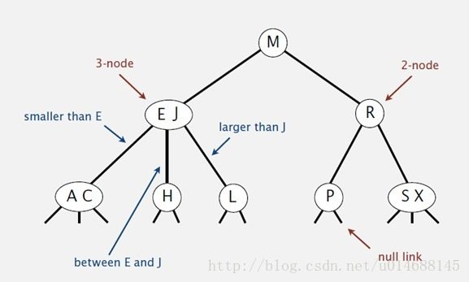
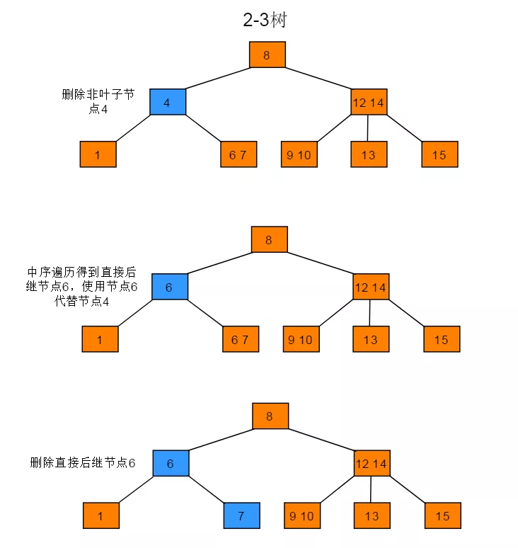
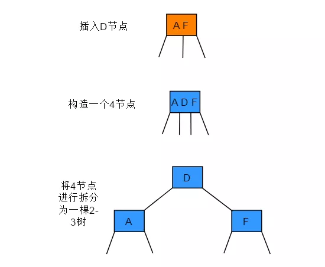
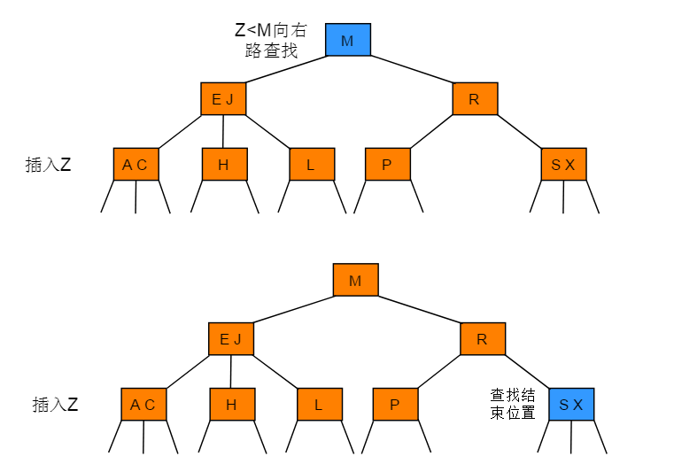
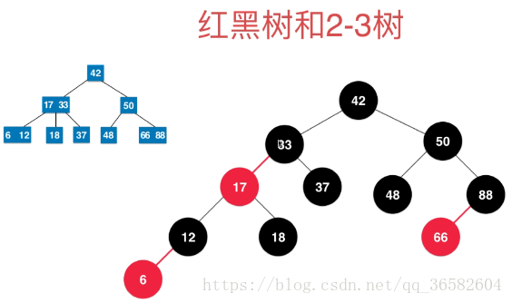
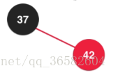
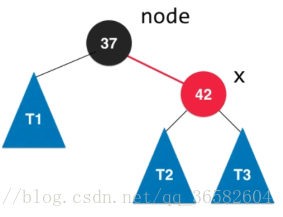
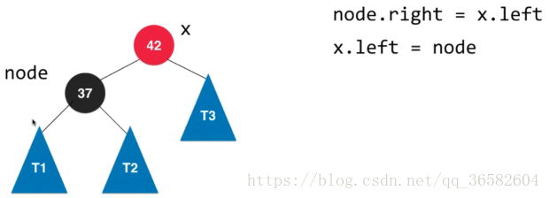
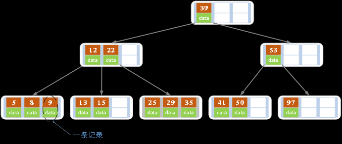

#### 二叉查找树(BST)
定义:是一颗二叉树,每个结点都大于左子树的任意节点,小于右子树的任意节点

分析:二叉查找树的算法运行时间取决于树的形状 在最好的情况下,一个N结点的树是完全平衡的,每条空链接和根节点的距离都为lgN,在最坏情况下,搜索路径上有N个节点,
此时树相当于链表
#### 平衡二叉树(AVL树)
是一种二叉排序树,其中每一个节点的左子树和右子树高度最多相差1
左子树深度减去右子树深度的值称为**平衡因子BF** 

#### 2-3查找树
为了保证树的平衡性,允许树的一个节点保存多个值,含有两条链接的成为2-结点,三链接的称为3-结点

实例:

对于非空23树插入主要分为 4 种情况：
- 向 2- 节点中插入新节点:这种情况比较简单,直接将2节点变成3节点插入即可
- 向一棵只含 3- 节点的树中插入新节点:因为已经是三节点了,所以无法直接插入,先创建一个4-节点,然后将4-节点转化为一个三个2-节点
构造过程:

- 向一个父节点为 2- 节点的 3- 节点中插入新节点:先等同情况2,狗构造一个4-节点,然后分解,将其移动到原来的父节点
因为父节点是一个2-节点,将父节点变成3-节点即可

- 向一个父节点为 3- 节点的 3- 节点中插入新节点: 在情况三的基础上,但由于父节点已经是个3-节点,此时再次进行变化,将4-节点分解为
两个2-节点,不断向上分解,将中值插入更高层的父节点

#### 红黑二叉查找树
红黑二叉树的基本思想就是用标准的二叉查找树和一些额外信息来表示2-3树
红链接:将两个节点链接起来构成一个三节点
黑链接:就是2-3树中的普通节点
- 如果一个节点存在黑子节点,那么该节点一定会有两个子节点
- 基于红黑树都能保证操作的运行时间是对数级别
- 准确来说,就是将3-节点表示为由一条左斜的红色链接相连的红色链接,如图:

一种等价的定义:
- 红链接均为左链接
- 没有任何一个节点同时和两条红链接相连
- 该树是**完美黑色平衡**,严格意义上不是平衡二叉树,**黑平衡**,即任意空链接(叶子节点)到根节点的的路径上的黑链接数量相等
将红黑树画平,将红链接合并,就是一个2-3树,如图:
  

旋转:
在我们的实际操作过程中,可能会出现红色右链接或者两条连续的红链接,我们将其小心的旋转与修复
比如一条红色的右链接转化为左链接,该操作称之为**左旋转**,将两个节点中的较小者作为根节点变成将较大者作为根节点
现在，我们假定红黑树还是只有一个根节点37，现在向树中添加一个比37大的元素42,注意,**加入节点初始都是红色**

这个时候就需要进行左旋操作

旋转完成后我们再对两个节点的颜色做个调换

红黑树的性质:
- 节点是红色或黑色。
- 根是黑色。
- 所有叶子都是黑色（叶子是NIL节点）。
- 每个红色节点必须有两个黑色的子节点。（从每个叶子到根的所有路径上不能有两个连续的红色节点。）
- 从任一节点到其每个叶子的所有简单路径都包含相同数目的黑色节点。
- 没有相联的两个红色链接

需要旋转的时机:当插入节点时(默认为红色),破坏了红黑树的性质,所以需要通过左旋来控制
#### 多路查找树(B树)
多路查找树有
- 2-3树
- 2-3-4树
- B树
- B+树
一个节点只能存储一个元素,在元素非常多的时候,使得树的高度非常大,这就使得内存存取次数非常多,所以需要打破每一个结点只存储一个元素的限制->多路查找树
多路查找树:每一个结点的孩子树可以多于两个,且每个结点处可以存储多个元素

B树:是一种平衡的多路查找树,2-3树和2-3-4树都是B树的特例,结点最大的孩子数目称为B树的阶,因此,2-3树是3阶B树,2-3-4树是4阶B树

性质:
- 每个结点最多有m-1个关键字。

- 根结点最少可以只有1个关键字。

- 非根结点至少有Math.ceil(m/2)-1个关键字。

- 每个结点中的关键字都按照从小到大的顺序排列，每个关键字的左子树中的所有关键字都小于它，而右子树中的所有关键字都大于它。

- 所有叶子结点都位于同一层，或者说根结点到每个叶子结点的长度都相同。

- 每个节点都存有索引和数据，也就是对应的key和value。
#### B+树
在B树结构中,我们往返于每个结点之间,也就是说需要在硬盘的页面之间进行多次访问,所以在B树基础上加上了新的元素组织方式,这就是B+树

在B树中,每个元素在该树中只出现过一次,但在B+树中,出现在分支结点中的元素会被当作他们在该分支结点位置的中序后继者(叶子结点)再次列出

并且,每个叶子结点都会保存一个指向后一个叶子结点的指针,这样的好处就是如果是顺序查找,我们直接从最左侧的叶子结点开始,不需要经过分支结点

尤其适合范围查找