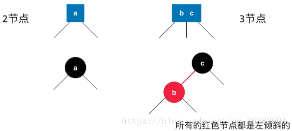
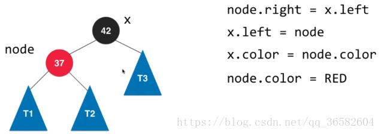

#### 二叉查找树(BST)
定义:是一颗二叉树,每个结点都大于左子树的任意节点,小于右子树的任意节点
分析:二叉查找树的算法运行时间取决于树的形状
在最好的情况下,一个N结点的树是完全平衡的,每条空链接和根节点的距离都为lgN,在最坏情况下,搜索路径上有N个节点,
此时树相当于链表

#### 2-3查找树
为了保证树的平衡性,允许树的一个节点保存多个值,含有两条链接的成为2-结点,三链接的称为3-结点

实例:

对于非空23树插入主要分为 4 种情况：
- 向 2- 节点中插入新节点:这种情况比较简单,直接将2节点变成3节点插入即可
- 向一棵只含 3- 节点的树中插入新节点:因为已经是三节点了,所以无法直接插入,先创建一个4-节点,然后将4-节点转化为一个三个2-节点
构造过程:

- 向一个父节点为 2- 节点的 3- 节点中插入新节点:先等同情况2,狗构造一个4-节点,然后分解,将其移动到原来的父节点
因为父节点是一个2-节点,将父节点变成3-节点即可

- 向一个父节点为 3- 节点的 3- 节点中插入新节点: 在情况三的基础上,但由于父节点已经是个3-节点,此时再次进行变化,将4-节点分解为
两个2-节点,不断向上分解,将中值插入更高层的父节点

#### 红黑二叉查找树
红黑二叉树的基本思想就是用标准的二叉查找树和一些额外信息来表示2-3树
红链接:将两个节点链接起来构成一个三节点
黑链接:就是2-3树中的普通节点
如果一个节点存在黑子节点,那么该节点一定会有两个子节点
基于红黑树都能保证操作的运行时间是对数级别
准确来说,就是将3-节点表示为由一条左斜的红色链接相连的红色链接,如图:

一种等价的定义:
- 红链接均为左链接
- 没有任何一个节点同时和两条红链接相连
- 该树是**完美黑色平衡**,严格意义上不是平衡二叉树,**黑平衡**,即任意空链接(叶子节点)到根节点的的路径上的黑链接数量相等
将红黑树画平,将红链接合并,就是一个2-3树,如图:

旋转:
在我们的实际操作过程中,可能会出现红色右链接或者两条连续的红链接,我们将其小心的旋转与修复
比如一条红色的右链接转化为左链接,该操作称之为**左旋转**,将两个节点中的较小者作为根节点变成将较大者作为根节点
现在，我们假定红黑树还是只有一个根节点37，现在向树中添加一个比37大的元素42,注意,**加入节点初始都是红色**

这个时候就需要进行左旋操作

旋转完成后我们再对两个节点的颜色做个调换

红黑树的性质:

